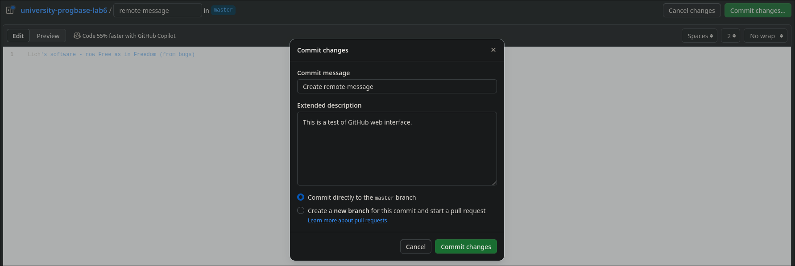

#	Основы программирования &ndash; лабораторная работа №6

Этот репозиторий представляет собой решение
лабораторной работы от моего университета, а этот файл &mdash; отчёт по ней.

Работа принадлежит студенту, 13-му по списку в группе[^1].

#	Содержание[^2]

1.	[Цель работы](#цель-работы)
	1.	[Реквизиты](#реквизиты)
1.	[Сделанные до работы шаги](#сделанные-до-работы-шаги)
1.	[Создание форка репозитория](#создание-форка-репозитория)
1.	[Клонирование репозитория](#клонирование-репозитория)
1.	[Редактирование в GitHub](#редактирование-в-github)
1.	[Подтягивание удалённых изменений](#подтягивание-удалённых-изменений)
1.	[История операций](#история-операций)
1.	[Просмотр изменений](#просмотр-изменений)
1.	[Слияние веток](#слияние-веток)
	1.	[Ручное разрешение конфликта](#ручное-разрешение-конфликта)
1.	[Удаление веток](#удаление-веток)
1.	[Произвольное создание коммитов](#произвольное-создание-коммитов)
1.	[Откат изменений](#откат-изменений)
1.	[Создание ветки](#создание-ветки)

#	Цель работы

Изучение базовых возможностей системы управления версиями,
опыт работы с Git Api, опыт работы с локальным и удаленным репозиторием.

##	Реквизиты

Основное использованное программное обеспечение в этой работе:
-	Операционная система Linux
-	Клиент [Git] в командной строке версии 2.44.2

Снятие сессий терминала прозведено с помощью [Asciinema] версии 2.4.0,
а также конвертировано в GIF с помощью [agg] версии 1.4.3.
Эти сессии будут регулярно фигурировать в отчёте для показа процесса работы.

Во всех сессиях терминала использованы следующие программы[^3]:
-	Командная оболочка: [fish] 3.7.1
-	Текстовый редактор: [Helix] 24.7
-	Просмотр файлов без редактирования: [bat] 0.23.0, под псевдонимом `cat`
-	Просмотр изменений Git: [delta] 0.17.0
-	Просмотр каталогов: [eza] 0.13.0, под псевдонимами `ls` и `tree`
-	Прочие не перечисленные утилиты: [Coreutils] 9.5

[Git]: https://git-scm.com
[Asciinema]: https://asciinema.org
[agg]: https://github.com/asciinema/agg
[fish]: https://fishshell.com
[Helix]: https://helix-editor.com
[bat]: https://github.com/sharkdp/bat
[Coreutils]: https://www.gnu.org/software/coreutils
[delta]: https://github.com/dandavison/delta
[eza]: https://github.com/eza-community/eza

#	Сделанные до работы шаги

Прочитав условия задачи, оказалось, что следующие шаги уже выполнены:
1.	[x]	Создан аккаунт на GitHub.
1.	[ ]	Форк не создан.
1.	[x]	Установлен Git.
1.	[x]	Настроен Git.
1.	[ ] ...

Что GitHub, что Git уже используются мной для моей деятельности разработчика,
поэтому не удивительно, что они у меня уже есть.
Git отконфигурирован следующим образом (файл `~/.gitconfig`):

```git-config
[user]
	email = author@lch361.net
	name = lch361

[core]
	pager = delta
	excludesfile = /home/lch361/.gitignore

[interactive]
	diffFilter = delta --color-only

[delta]
	navigate = true    # use n and N to move between diff sections
	light = false      # set to true if you're in a terminal w/ a light background color (e.g. the default macOS terminal)

[merge]
	conflictstyle = diff3

[diff]
	colorMoved = default

[init]
	defaultBranch = main
```

После этого, можем приступать к выполнению работы с тех шагов, которые пока что
не сделаны.

#	Создание форка репозитория

Имея аккаунт в GitHub, возможно импортировать себе в профиль чужие репозитории:
это скопирует всю историю изменений, но сохранит ссылку на оригинал.
На скриншоте ниже приведено создание форка для этого репозитория.


Как видно по скриншоту, можно отредактировать название репозитория, его описание,
а также переключить одну очень важную галочку &mdash; синхронизировать *только*
ветку `master` или все. Для этой работы **очень важно**, чтобы галочка не стояла
включённой &mdash; нам понадобятся все имеющиеся ветки.

#	Клонирование репозитория

А чтобы скопировать удалённый репозиторий GitHub к себе на устройство,
понадобятся две вещи: настроенные ключи клиента [SSH] и SSH&ndash;ссылка на
репозиторий. Клонирование через SSH &mdash; самый простой способ на моей памяти
для клонирования репозитория с правом на не только чтение, но и на удалённую
запись. Ниже приведён описанный процесс.

[](https://asciinema.org/a/WVeFjNc3hywo9bxKifQpUxO3R)

[SSH]: https://www.openssh.com

#	Редактирование в GitHub

Удалённо тоже можно создавать файлы &mdash; прямо в интерфейсе GitHub.
Ниже приведено создание и коммит файла `remote-message`.
Это сразу создаёт новый коммит в ветку `master`.



#	Подтягивание удалённых изменений

После добавления файла через веб&ndash;интерфейс случился
рассинхрон между локальным и удалённым репозиторием.
Не проблема: ниже приведено подтягивание удалённых изменений
в локальный репозиторий.
После этого репозитории идентичны и синхронизированы.

[](https://asciinema.org/a/4ErzPI6ridWDnM8AZFdQRFhKa)

#	История операций

Ниже приведён просмотр всех коммитов всех веток.
Тут занимательна пара вещей:
-	Имя и почта автора коммита через GitHub отличается от локально настроенной &mdash;
	эти параметры уже зависят от настройки аккаунта GitHub.
-	Команды для показа всех известных веток:
	```sh
	git branch --list
	git branch -l
	```
	При первом вызове команда лишь показывает `master`.
	Лишь после попытки сменить ветку:
	```sh
	git switch branch1
	```
	Произойдёт обновление списка веток.
	Полагаю, такая особенность работы с удалёнными ветками.

[](https://asciinema.org/a/q7olxYptEeAhBHdF4dkXTKZsD)

#	Просмотр изменений

Изменения в системе Git представлены файлами в формате `.diff`, и могут выглядеть,
например, так:

```diff
diff --git a/mergefile.txt b/mergefile.txt
index 8b13789..39c9730 100644
--- a/mergefile.txt
+++ b/mergefile.txt
@@ -1 +1,6 @@
-
+Файл
+заполнен
+информацией
+противоречащей
+ветке
+master
```

Ниже приведены процессы получения изменений произвольных коммитов,
а также лишь нескольких последних.

[](https://asciinema.org/a/YGfAjTiK6ZGtj2se1ZeYfn6Is)

[](https://asciinema.org/a/wFpXiTOQ99HFaGlrSP7An28n3)

#	Слияние веток

Несколько веток можно слить в одну, объединив их истории.
Например, эта команда...

```sh
git merge branch1  # находясь в ветке master
```

...объединит ветку `branch1` в `master`.

Но что если ветки имеют разные файлы с разным содержимым?
В случае, когда не получается просто наложить одни изменения поверх других,
возникает *конфликт слияния*.
В следующем подразделе приведён один из способов борьбы с ним.

##	Ручное разрешение конфликта

Самый простой способ разрешения конфликта &mdash; вручную отредактировать
проблемные файлы и сделать коммит.
Процесс приведён ниже.

[](https://asciinema.org/a/qrKhIJgoacW44QM6SGdGUiqXz)

#	Удаление веток

Ниже приведён процесс удаления веток *как локальной, так и удалённой*.
Значит, после этой операции не только в локальном репозитории осталась одна лишь
ветка `master`: в GitHub также исчезнет ветка `branch1`.

[](https://asciinema.org/a/dHxlJm0o16CjkJPFuojLhOLjA)

#	Произвольное создание коммитов

Ниже приведена произвольная последовательность манипуляций файлами, но что важно,
каждая сопровождается созданием коммита.

[](https://asciinema.org/a/5eMZY0D5qWq1KPjo7epYjpe1m)

#	Откат изменений

А на случай, если нужно удалённо (или даже локально) откатить изменения.
И нет, мы ***не*** говорим о таких сильных командах, как

```sh
git reset --hard HEAD~3
git push --force
```

Хотя им тоже есть применение, в этой работе применён метод помягче:
создание реверсивного коммита. Ниже приведён процесс отката всех редактирований
из предыдущего раздела.

[](https://asciinema.org/a/F1dLu5uUTAB4BFiO6E0csD31x)

#	Создание ветки

Для написания отчёта предлагается создать новую ветку &mdash; именно так и
появился на свет `README.md` *(этот файл)*.
Ниже приведён этот совсем несложный процесс.

[](https://asciinema.org/a/OKCjl8Bhp14cMIWMV7Bra3gN6)

Дальнейшее редактирование отчёта произойдёт за кадром, хотя коммиты
по частям работы будут сделаны, продвинув историю ветки `report` над `master`.

[^1]: Если вы &mdash; мой преподаватель или одногруппник, вы знаете о ком речь.
[^2]: Удивительно, но в Markdown списки можно лишь автоматически нумеровать,
просто начиная строки с "1.".
[^3]: Но это не означает, что нельзя выполнить эту лабораторную работу с другими
программами, другой ОС. Решает лишь наличие Git и командной строки.