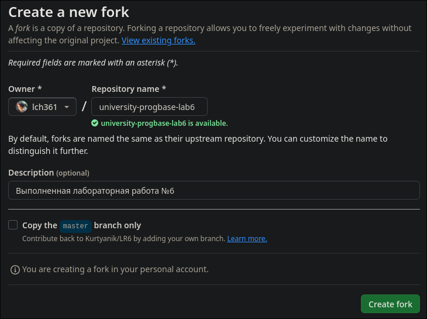

#	Основы программирования &ndash; лабораторная работа №6

Этот репозиторий представляет собой решение
лабораторной работы от моего университета, а этот файл &mdash; отчёт по ней.

Работа принадлежит студенту, 13-му по списку в группе.
Если вы &mdash; мой преподаватель или одногруппник, вы знаете о ком речь.

#	Содержание

1.	[Цель работы](#цель-работы)
	1.	[Реквизиты](#реквизиты)
1.	[Сделанные до работы шаги](#сделанные-до-работы-шаги)
1.	[Создание форка репозитория](#создание-форка-репозитория)

#	Цель работы

Изучение базовых возможностей системы управления версиями,
опыт работы с Git Api, опыт работы с локальным и удаленным репозиторием.

##	Реквизиты

Основное использованное программное обеспечение в этой работе:
-	Операционная система Linux
-	Клиент [Git] в командной строке версии 2.44.2

Снятие сессий терминала прозведено с помощью [Asciinema] версии 2.4.0,
а также конвертировано в GIF с помощью [agg] версии 1.4.3.
Эти сессии будут регулярно фигурировать в отчёте для показа процесса работы.

Во всех сессиях терминала использованы следующие программы:
-	Командная оболочка: [fish] 3.7.1
-	Текстовый редактор: [Helix] 24.7
-	Просмотр файлов без редактирования: [bat] 0.23.0, под псевдонимом `cat`
-	Просмотр изменений Git: [delta] 0.17.0
-	Просмотр каталогов: [eza] 0.13.0, под псевдонимом `ls`
-	Прочие не перечисленные утилиты: [Coreutils] 9.5

[Git]: https://git-scm.com
[Asciinema]: https://asciinema.org
[agg]: https://github.com/asciinema/agg
[fish]: https://fishshell.com
[Helix]: https://helix-editor.com
[bat]: https://github.com/sharkdp/bat
[Coreutils]: https://www.gnu.org/software/coreutils
[delta]: https://github.com/dandavison/delta
[eza]: https://github.com/eza-community/eza

#	Сделанные до работы шаги

Прочитав условия задачи, оказалось, что следующие шаги уже выполнены:
1.	[x]	Создан аккаунт на GitHub.
1.	[ ]	Форк не создан.
1.	[x]	Установлен Git.
1.	[x]	Настроен Git.
1.	[ ] ...

Что GitHub, что Git уже используются мной для моей деятельности разработчика,
поэтому не удивительно, что они у меня уже есть.
Git отконфигурирован следующим образом (файл `~/.gitconfig`):

```git-config
[user]
	email = author@lch361.net
	name = lch361

[core]
	pager = delta
	excludesfile = /home/lch361/.gitignore

[interactive]
	diffFilter = delta --color-only

[delta]
	navigate = true    # use n and N to move between diff sections
	light = false      # set to true if you're in a terminal w/ a light background color (e.g. the default macOS terminal)

[merge]
	conflictstyle = diff3

[diff]
	colorMoved = default

[init]
	defaultBranch = main
```

После этого, можем приступать к выполнению работы с тех шагов, которые пока что
не сделаны.

#	Создание форка репозитория

Имея аккаунт в GitHub, возможно импортировать себе в профиль чужие репозитории:
это скопирует всю историю изменений, но сохранит ссылку на оригинал.
На скриншоте ниже приведено создание форка для этого репозитория.



Как видно по скриншоту, можно отредактировать название репозитория, его описание,
а также переключить одну очень важную галочку &mdash; синхронизировать *только*
ветку `master` или все. Для этой работы **очень важно**, чтобы галочка не стояла
включённой &mdash; нам понадобятся все имеющиеся ветки.
